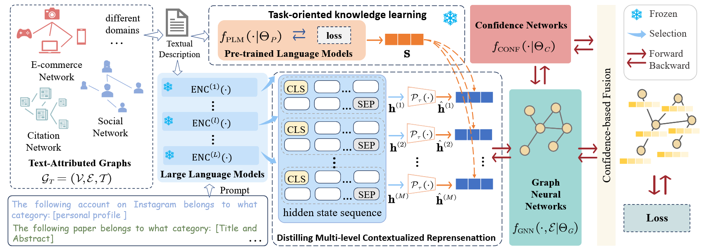

<h2 align="center"> <a href="https://www.ijcai.org/proceedings/2025/569">HiTuner: Hierarchical Semantic Fusion Model Fine-Tuning on Text-Attributed Graphs
</a></h2>

<div align="center">

**Zihan Fang<sup>1,2</sup>, Zhiling Cai <sup>3</sup>, Yuxuan Zheng<sup>1,2</sup>, Shide Du<sup>1,2</sup>, Yanchao Tan<sup>1,2</sup>, Shiping Wang<sup>1,2</sup>**

<sup>1</sup>College of Computer and Data Science, Fuzhou University, Fuzhou 350108, China<br>
<sup>2</sup>Key Laboratory of Intelligent Metro, Fujian Province University, Fuzhou 350108, China<br>
<sup>3</sup>College of Computer and Information Science, Fujian Agriculture and Forestry University, Fuzhou 350002, China<br>
</div>

## Abstract
Text-Attributed Graphs (TAGs) are vital for modeling entity relationships across various domains. Graph Neural Networks have become cornerstone for processing graph structures, while the integration of text attributes remains a prominent research. The development of Large Language Models (LLMs) provides new opportunities for advancing textual encoding in TAGs. However, LLMs face challenges in specialized domains due to their limited task-specific knowledge, and fine-tuning them for specific tasks demands significant resources. To cope with the above challenges, we propose HiTuner, a novel framework that leverages fine-tuned Pre-trained Language Models (PLMs) with domain expertise as tuner to enhance the hierarchical LLM contextualized representations for modeling TAGs. Specifically, we first strategically select hierarchical hidden states of LLM to form a set of diverse and complementary descriptions as input for the sparse projection operator. Concurrently, a hybrid representation learning is developed to amalgamate the broad linguistic comprehension of LLMs with task-specific insights of the fine-tuned PLMs. Finally, HiTuner employs a confidence network to adaptively fuse the semantically-augmented representations. Empirical results across benchmark datasets spanning various domains validate the effectiveness of the proposed framework.

## Model Architecture
<div align="center">
  
</div>

## Configure the Setup:

The configuration parameters are stored in the `config.py` file. You can customize them as needed for your specific setup.

    ```
    # Setup configuration
    cfg.dataset = 'cora'
    cfg.llm.name = "llama"
    cfg.lm.name = 'bert-base-uncased'
    cfg.gnn.model.name = 'SAGE'

    ```
   

## Datasets:

The datasets used can be downloaded from [here](https://drive.google.com/drive/folders/1MUx97je9je2MMDJGWxtc1S4Pl8DEdqS0), 
please download them and put them in datasets to `cfg.data_path`.

| Dataset    | # Nodes | # Edges | # Clusters | Domain        |
|------------|---------|---------|------------|---------------|
| CiteSeer   | 3,186   | 4,277   | 6          | Academic      |
| Cora       | 2,708   | 5,429   | 7          | Academic      |
| Instagram  | 11,339  | 144,010 | 2          | Social        |
| Photo      | 48,362  | 500,928 | 12         | E-commerce    |
| PubMed    | 19,717  | 44,338  | 3          | Academic      |
| WikiCS    | 11,701  | 216,123 | 10         | Wikipedia     |


## Runing Commands

### Step 1. 
```
python3 LLM_infer.py 
```
The cache.py will load the textual data of TAG, and next transform them to token embedding by LLM, which will be saved into `cfg.llm.cache_path`. 


### Step 2. 
```
python3 LM_train.py 
```
LM_train.py  will divide the dataset into nodes according to the training rate and save the divided nodes. 
Then it will be updated through small-scale pre-trained model training and saved in output_trainratio{`cfg.train_ratio`}.
The saved embeddings will used in the training of HiTuner.


### Step 3. 

```
python3 HiTuner_test.py 
```
After preprocessing the dataset, we run HiTuner for downstream tasks.


## Reference

If you find our work useful in your research, please consider citing:

```
@inproceedings{hituner,
  title={HiTuner: Hierarchical Semantic Fusion Model Fine-Tuning on Text-Attributed Graphs},
  author={Zihan Fang and Zhiling Cai and Yuxuan Zheng and Shide Du and Yanchao Tan and Shiping Wang},
  booktitle={Proceedings of the Thirty-Fourth International Joint Conference on Artificial Intelligence},
    pages     = {5110--5117},
  year      = {2025}
}
```
